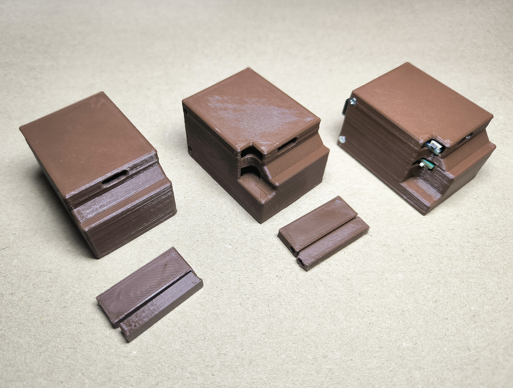

# BioListener 3D Models

This repository contains the **Fusion360 model sources** and **STL files** for the **BioListener project**.

## Included Models
- **BioListener V1.0 Boards 3D Printed Case**

### BioListener V1.0 Boards 3D Printed Case

#### Prototypes

  

#### Final Design

  

#### Assembly
- 3D print the case with regular FDM 3D printer.  
- Then, install 4pcs hot press inserts (M2 OD 3.2mm, length 2.5mm) on the covers. 
- Finally, assemble the case with 4pcs M2 (length 5mm) screws.

## License

This repository uses the following licenses:
- **Hardware design files** - The hardware design files in this repository are licensed under the **CERN Open Hardware Licence, Version 2 - Strongly Reciprocal**. 
